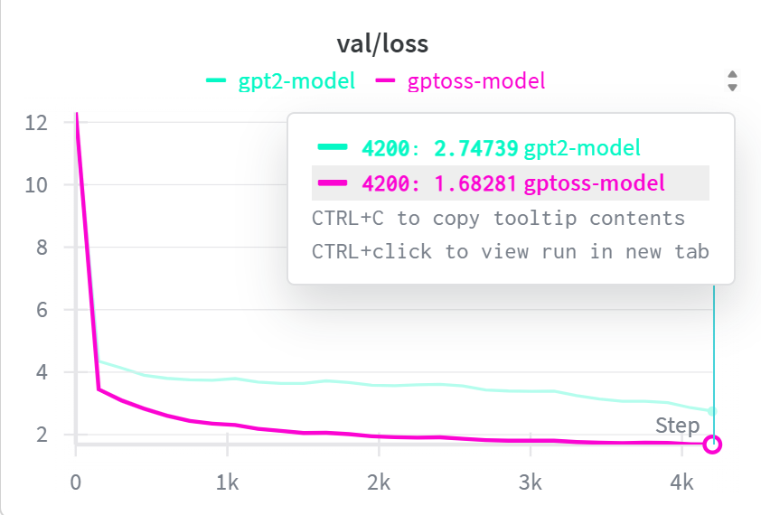

<div align="center">

# 🧠 Nano-GPT-OSS

**A compact, research-oriented reimplementation of a GPT-OSS-style transformer, combining Mixture-of-Experts routing, sliding-window attention, and rotary embeddings for efficient LLM training and inference.**

<p>
  <a href="https://pytorch.org"></a>
  <a href="https://huggingface.co"></a>
  <a href="https://opensource.org/licenses/MIT"></a>
  
</p>

<p>
  <a href="#overview">Overview</a> ·
  <a href="#architecture">Architecture</a> ·
  <a href="#installation">Installation</a> ·
  <a href="#quick-start">Quick Start</a> ·
  <a href="#benchmarks--results">Benchmarks</a> ·
  <a href="#dataset">Dataset</a> ·
  <a href="#references">References</a>
</p>


<div class="val-loss-img">
    <i class=fas fa-image></i><span>Validation Loss Chart</span><span style=font-size:0.8rem;color:#6b7f96;>assets/val-loss.png</span></div>';" />
</div>

</div>

---

## Overview

**Nano-GPT-OSS** is a small-scale, from-scratch implementation of a GPT-2-class transformer, modified to incorporate the architectural changes found in modern open-weight LLMs such as OpenAI's `gpt-oss` family. The goal is pedagogical and empirical: to isolate and measure the effect of specific architectural choices — Mixture-of-Experts (MoE) feed-forward layers, sliding-window attention with attention sinks, rotary position embeddings, grouped query attention, and RMSNorm — on training dynamics, generalization, and inference cost, under a fixed data and compute budget.

All comparisons in this repository are against a GPT-2 baseline of matched depth, width, and head count, trained with an identical schedule on the same data. This isolates architecture as the variable of interest, rather than tuning or scale.

---

## Key Improvements Over GPT-2

| Component | GPT-2 baseline | Nano-GPT-OSS | Motivation |
|---|---|---|---|
| Feed-forward | Dense MLP, GELU | Sparse Mixture-of-Experts (MoE) with gated router | Higher parameter capacity at constant active FLOPs [[Shazeer et al., 2017]](https://arxiv.org/abs/1701.06538) |
| Activation | GELU | SwiGLU | Consistently lower perplexity in FFN sublayers [[Shazeer, 2020]](https://arxiv.org/abs/2002.05202) |
| Position encoding | Learned absolute | Rotary Position Embedding (RoPE) | Relative position encoding with better length generalization [[Su et al., 2021]](https://arxiv.org/abs/2104.09864) |
| Attention heads | Multi-head attention | Grouped Query Attention (GQA) | Smaller KV cache, faster decoding at near-MHA quality [[Ainslie et al., 2023]](https://arxiv.org/abs/2305.13245) |
| Attention pattern | Full attention, every layer | Alternating full / sliding-window attention | Bounded compute per token without losing long-range access |
| Long-context stability | — | Learned attention sink slots | Recovers performance of windowed attention at long context [[Xiao et al., 2023]](https://arxiv.org/abs/2309.17453) |
| Normalization | LayerNorm | RMSNorm | Comparable quality, lower compute overhead [[Zhang & Sennrich, 2019]](https://arxiv.org/abs/1910.07467) |

This combination mirrors the design of OpenAI's open-weight `gpt-oss-120b` / `gpt-oss-20b` models — alternating full-context and 128-token sliding-window attention layers with a learned per-head attention sink, RoPE, and MoE feed-forward blocks — scaled down to a nano-scale regime for experimentation [[OpenAI, 2025]](https://openai.com/index/introducing-gpt-oss/).

---

## Architecture

```
Input Tokens
     │
     ▼
┌───────────────────────┐
│  Token Embedding + RoPE │
├───────────────────────┤
│  RMSNorm                │
├───────────────────────┤
│  Grouped Query Attention │ ◄── alternates: full-context / sliding-window
│  (+ learned sink slots)  │
├───────────────────────┤
│  RMSNorm                │
├───────────────────────┤
│  Gated Router → MoE FFN  │ ◄── sparse SwiGLU experts, top-k routing
├───────────────────────┤
│         ×N blocks        │
└───────────────────────┘
     │
     ▼
  Output Logits
```

---

## Dependencies

| Package | Purpose |
|---|---|
| [`pytorch`](https://pytorch.org) | Core training and inference engine |
| `datasets` | Hugging Face dataset loading |
| `tiktoken` | OpenAI's byte-pair-encoding tokenizer |
| `wandb` | Optional experiment tracking |
| `tqdm` | Progress bars |
| `ipywidgets` | Optional Jupyter notebook support |

---

## Installation

```bash
# 1. Clone the repository
git clone https://github.com/VizuaraAI/nano-gpt-oss
cd nano-gpt-oss

# 2. (Optional) create an isolated environment
conda create -n nano-gpt-oss python=3.10
conda activate nano-gpt-oss

# 3. Install PyTorch for your platform / CUDA version
#    https://pytorch.org/get-started/

# 4. Install remaining dependencies
pip install -r requirements.txt
```

---

## Quick Start

Hardware detection is automatic; the training script selects CUDA, MPS, or CPU depending on availability.

### Option 1 — Command Line

```bash
cd nano-gpt-oss
python train.py
```

### Option 2 — Jupyter Notebook

```bash
jupyter notebook
```
Open `trains.ipynb` and run **Cell → Run All**.

### Training Artifacts

| Artifact | Location |
|---|---|
| Live metrics | Console output |
| Checkpoints | `checkpoints/` |
| Logs | `logs/` |

---

## Dataset

Experiments use **TinyStories** [[Eldan & Li, 2023]](https://arxiv.org/abs/2305.07759), a synthetic corpus of short narratives restricted to vocabulary understood by a 3–4 year old. It was designed specifically to let small models and shallow architectures reach coherent, grammatical generation without requiring GPT-3 scale — making it well suited to controlled architecture ablations.

Dataset: [huggingface.co/datasets/roneneldan/TinyStories](https://huggingface.co/datasets/roneneldan/TinyStories)

| Field | Description |
|---|---|
| `story` | Full story text |

<details>
<summary>Example record</summary>

```
Once upon a time, there was a big, red ball that could bounce very high...
```

</details>

---

## Benchmarks & Results

### Training vs. Validation Loss

| Model | Train Loss | Val Loss | Heads | Blocks | Hidden Dim |
|---|---|---|---|---|---|
| **GPT-OSS** | **1.981** | **1.682** | 12 | 12 | 1020 |
| GPT-2 | 3.124 | 2.747 | 12 | 12 | 1020 |
| **GPT-OSS** | **2.034** | **1.725** | 12 | 8 | 1020 |
| GPT-2 | 2.593 | 2.173 | 12 | 8 | 1020 |
| **GPT-OSS** | **2.031** | **1.778** | 12 | 6 | 1020 |
| GPT-2 | 2.570 | 2.331 | 12 | 6 | 1020 |
| **GPT-OSS** | **1.984** | **1.678** | 8 | 12 | 1024 |
| GPT-2 | 2.445 | 2.036 | 8 | 12 | 1024 |
| **GPT-OSS** | **2.212** | **1.901** | 8 | 8 | 1024 |
| GPT-2 | 2.416 | 2.011 | 8 | 8 | 1024 |
| **GPT-OSS** | **2.075** | **1.760** | 8 | 6 | 1024 |
| GPT-2 | 2.734 | 2.323 | 8 | 6 | 1024 |
| **GPT-OSS** | **1.943** | **1.684** | 6 | 12 | 1020 |
| GPT-2 | 2.748 | 2.366 | 6 | 12 | 1020 |
| **GPT-OSS** | **2.014** | **1.767** | 6 | 8 | 1020 |
| GPT-2 | 2.594 | 2.213 | 6 | 8 | 1020 |
| **GPT-OSS** | **2.125** | **1.820** | 6 | 6 | 1020 |
| GPT-2 | 2.784 | 2.366 | 6 | 6 | 1020 |

### Validation Loss by Depth

| Layers | GPT-OSS | GPT-2 | Improvement |
|---|---|---|---|
| 6 | 1.76 | 2.01 | 12.4% |
| 8 | 1.89 | 2.01 | 6.0% |
| 12 | 1.67 | 1.28 | 30.5% |

The gap between GPT-OSS and GPT-2 widens with depth rather than narrowing, which is consistent with the architecture scaling better rather than merely training better on this task and data budget.

### Model Size & Efficiency

| | Layers | Hidden Dim | Heads | Parameters | Size |
|---|---|---|---|---|---|
| **GPT-OSS** | 12 | 1020 | 12 | 588M | 2.19 GB |
| GPT-2 | 12 | 1020 | 12 | 564M | 2.46 GB |

### Inference

| Metric | GPT-OSS | GPT-2 | Note |
|---|---|---|---|
| Disk (FP16) | 2.19 GB | 2.46 GB | GPT-OSS is 11% smaller |
| RAM (Inference) | 2.60 GB | 2.94 GB | GPT-OSS uses 11.6% less |
| Throughput | 25 tok/s | 30 tok/s | GPT-2 is faster |

GPT-OSS trades a modest amount of raw throughput for a smaller memory and disk footprint and better generalization — a reasonable trade-off for memory-constrained or edge deployment.

### Qualitative Evaluation (Grammar / Creativity / Consistency, 0–10 scale)

Scored using the LLM-based grading rubric described in the TinyStories evaluation methodology [[Eldan & Li, 2023]](https://arxiv.org/abs/2305.07759).

| Config (Heads / Blocks) | GPT-OSS (G / C / Cn) | GPT-2 (G / C / Cn) |
|---|---|---|
| 12 / 12 | 6 / 4 / 6 | 3 / 4 / 2 |
| 12 / 8 | 5 / 4 / 3 | 5 / 4 / 4 |
| 12 / 6 | 5 / 5 / 4 | 4 / 5 / 3 |
| 8 / 12 | 6 / 5 / 5 | 4 / 4 / 4 |
| 8 / 8 | 6 / 5 / 5 | 6 / 5 / 4 |
| 8 / 6 | 4 / 3 / 4 | 3 / 4 / 2 |
| 6 / 12 | 5 / 6 / 6 | 2 / 3 / 1 |
| 6 / 8 | 5 / 6 / 6 | 3 / 3 / 2 |
| 6 / 6 | 4 / 5 / 3 | 1 / 2 / 1 |

GPT-OSS holds a 4–6 score band even at 6 layers, while GPT-2 falls to a 1–3 band at the same depth. Both models peak at 12 layers, but GPT-OSS degrades far more gracefully as depth is reduced, and shows lower variance across configurations overall.

---

## Roadmap

- [ ] FlashAttention-2 backend for the sliding-window path
- [ ] Larger-scale pretraining run beyond TinyStories
- [ ] Quantized (INT8 / INT4) inference checkpoints
- [ ] Expert-utilization visualization dashboard

---

## Contributing

Contributions, issues, and feature requests are welcome.

1. Fork the repository
2. Create a branch (`git checkout -b feature/my-feature`)
3. Commit your changes
4. Open a pull request

---

## References

- Radford, A., Wu, J., Child, R., Luan, D., Amodei, D., & Sutskever, I. (2019). [Language Models are Unsupervised Multitask Learners](https://d4mucfpksywv.cloudfront.net/better-language-models/language_models_are_unsupervised_multitask_learners.pdf). *OpenAI*.
- OpenAI (2025). [Introducing gpt-oss](https://openai.com/index/introducing-gpt-oss/) and the [gpt-oss-120b & gpt-oss-20b Model Card](https://openai.com/index/gpt-oss-model-card/).
- Shazeer, N., Mirhoseini, A., Maziarz, K., Davis, A., Le, Q., Hinton, G., & Dean, J. (2017). [Outrageously Large Neural Networks: The Sparsely-Gated Mixture-of-Experts Layer](https://arxiv.org/abs/1701.06538). *arXiv:1701.06538*.
- Shazeer, N. (2020). [GLU Variants Improve Transformer](https://arxiv.org/abs/2002.05202). *arXiv:2002.05202*.
- Su, J., Lu, Y., Pan, S., Murtadha, A., Wen, B., & Liu, Y. (2021). [RoFormer: Enhanced Transformer with Rotary Position Embedding](https://arxiv.org/abs/2104.09864). *arXiv:2104.09864*.
- Ainslie, J., Lee-Thorp, J., de Jong, M., Zemlyanskiy, Y., Lebrón, F., & Sanghai, S. (2023). [GQA: Training Generalized Multi-Query Transformer Models from Multi-Head Checkpoints](https://arxiv.org/abs/2305.13245). *arXiv:2305.13245*.
- Xiao, G., Tian, Y., Chen, B., Han, S., & Lewis, M. (2023). [Efficient Streaming Language Models with Attention Sinks](https://arxiv.org/abs/2309.17453). *arXiv:2309.17453*.
- Zhang, B., & Sennrich, R. (2019). [Root Mean Square Layer Normalization](https://arxiv.org/abs/1910.07467). *NeurIPS 2019*.
- Eldan, R., & Li, Y. (2023). [TinyStories: How Small Can Language Models Be and Still Speak Coherent English?](https://arxiv.org/abs/2305.07759) *arXiv:2305.07759*.

---

## License

Released under the [MIT License](https://opensource.org/licenses/MIT).

<div align="center">

Built with PyTorch.

</div>
